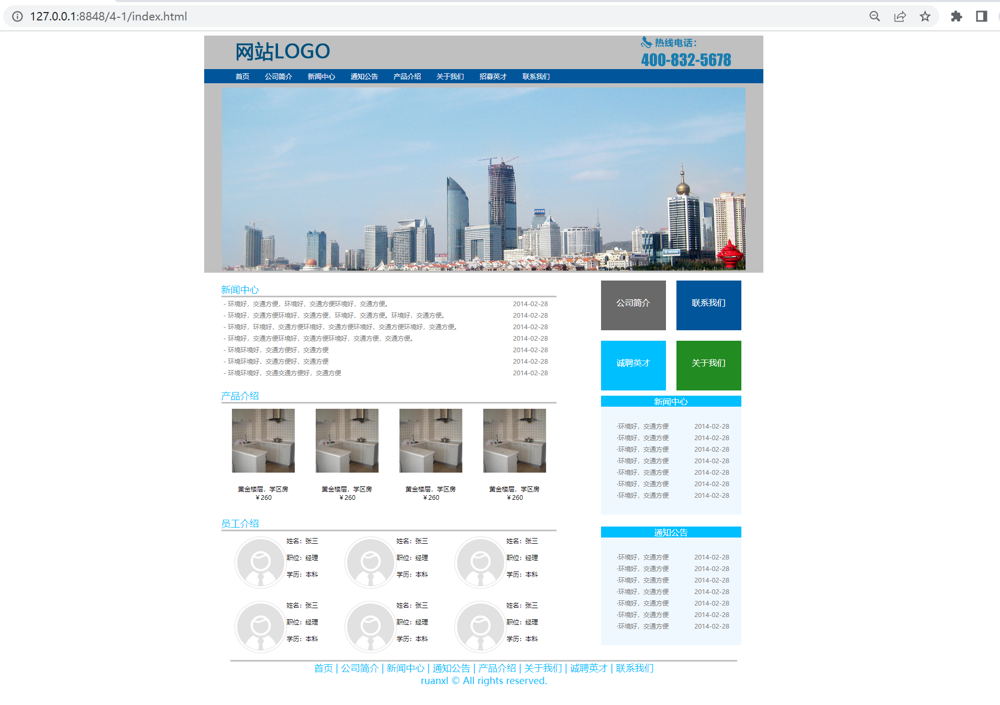
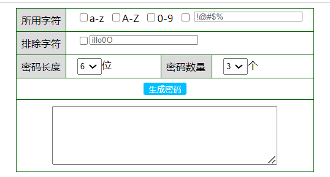
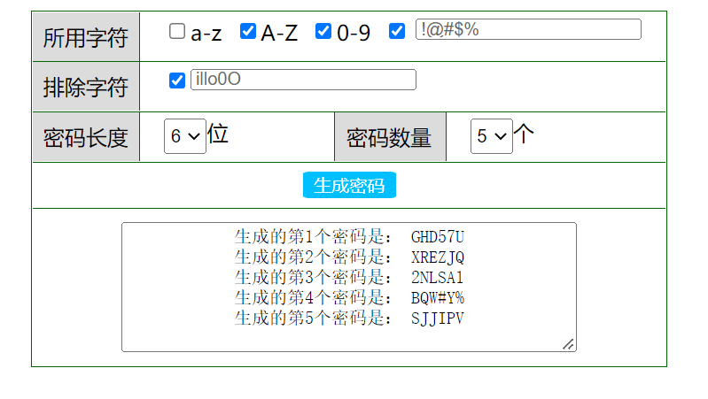
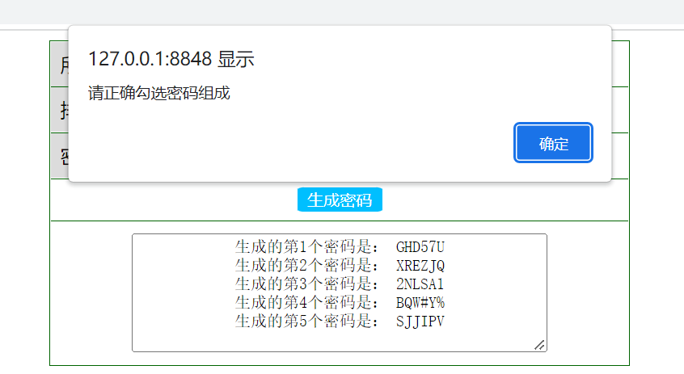

# <center> 西北农林科技大学信息工程学院实习报告

|  课程   |   学院   | 专业年级 |    学号    |
| :-----: | :------: | :------: | :--------: |
| Web技术 | 信息工程 | 软工2001 | 2020012249 |

|  姓名  | 周次 | 交报告时间 | 成绩 |
| :----: | :--: | :--------: | :--: |
| 张宇晨 |  13  | 2022.5.17  |      |


[toc]

## 任务一 设计网页

### 1. 源码

#### HTML

```html
<!DOCTYPE html>
<html>
	<head>
		<meta charset="utf-8" />
		<link href="css/4-1.css" rel="stylesheet" type="text/css" />
		<title>实习4-1</title>
	</head>
	<body>
		<div id = "top">
				<div id ="logoandtel">
					<div id="logo"></div>
					<div id="tel"></div>
				</div>
				<div id ="menu">
					<div class="smenu" id="fsmenu">首页</div>
					<div class="smenu">公司简介</div>
					<div class="smenu">新闻中心</div>
					<div class="smenu">通知公告</div>
					<div class="smenu">产品介绍</div>
					<div class="smenu">关于我们</div>
					<div class="smenu">招募英才</div>
					<div class="smenu">联系我们</div>
				</div>
				<div id="buidpic">
					
				</div>

		</div>
		
		<div id = "mid">
				<div id = "mleft">
					<div id ="news">
						<div class="title">新闻中心</div>
						<table>
							<tr><td>- 环境好，交通方便，环境好，交通方便环境好，交通方便。</td>
							<td>2014-02-28</td></tr>
							<tr><td>- 环境好，交通方便环境好，交通方便，环境好，交通方便。环境好，交通方便。</td>
							<td>2014-02-28</td></tr>
							<tr><td>- 环境好，环境好，交通方便环境好，交通方便环境好，交通方便环境好，交通方便。&nbsp;&nbsp;&nbsp;&nbsp;</td>
							<td>2014-02-28</td></tr>
							<tr><td>- 环境好，交通方便环境好，交通方便环境好，交通方便，交通方便。</td>
							<td>2014-02-28</td></tr>
							<tr><td>- 环境环境好，交通方便好，交通方便</td>
							<td>2014-02-28</td></tr>
							<tr><td>- 环境环境好，交通方便好，交通方便</td>
							<td>2014-02-28</td></tr>
							<tr><td>- 环境环境好，交通交通方便好，交通方便</td>
							<td>2014-02-28</td></tr>
						</table>
<!-- 						<ul>
							<li>环境好，交通方便，环境好，交通方便环境好，交通方便。&emsp;&emsp;&emsp;&emsp;&emsp;&emsp;&emsp;&emsp;&emsp;&nbsp; &emsp;&emsp;&emsp;2014-02-28</li>
							<li>环境好，交通方便环境好，交通方便，环境好，交通方便。环境好，交通方便。&emsp;&emsp;&emsp;2014-02-28</li>
							<li>环境好，环境好，交通方便环境好，交通方便环境好，交通方便环境好，交通方便。&nbsp;&nbsp;&nbsp;&nbsp; 2014-02-28</li>
							<li>环境好，交通方便环境好，交通方便环境好，交通方便，交通方便。&emsp;&emsp;&emsp;&emsp;&emsp;&emsp;&emsp;&emsp;&emsp;2014-02-28</li>
							<li>环境环境好，交通方便好，交通方便&emsp;&emsp;&emsp;&emsp;&emsp;&emsp;&emsp;&emsp;&emsp;&emsp;&emsp;&emsp;&emsp;&emsp;&emsp;&emsp;&emsp;&emsp;&emsp;2014-02-28</li>
							<li>环境环境好，交通方便好，交通方便2014-02-28</li>
							<li>环境环境好，交通方便好，交通方便2014-02-28</li>
						</ul> -->
					</div>
					<div id="productions">
						<div class="title">产品介绍</div>
						<div id="pro_pic">
							<div class="production">
								
							</div>
							<div class="production">
								
							</div>
							<div class="production">
								
							</div>
							<div class="production">
								
							</div>
						</div>
						<div id="pro_price">
							<div class="production">
								黄金楼层，学区房<br>￥260
							</div>
							<div class="production">
								黄金楼层，学区房<br>￥260
							</div>
							<div class="production">
								黄金楼层，学区房<br>￥260
							</div>
							<div class="production">
								黄金楼层，学区房<br>￥260
							</div>
						</div>
					</div>
					<div id ="staff">
						<div class="title">员工介绍</div>
						<div id="staff1">
								<div class="one_staff">
									<div></div>
									<div>姓名：张三 <br><br>职位：经理 <br><br>学历：本科<br></div>
								</div>
								<div class="one_staff">
									<div></div>
									<div>姓名：张三 <br><br>职位：经理 <br><br>学历：本科<br></div>
								</div>
								<div class="one_staff">
									<div></div>
									<div>姓名：张三 <br><br>职位：经理 <br><br>学历：本科<br></div>
								</div>
						</div>
						<div id="staff2">
							<div class="one_staff">
								<div></div>
								<div>姓名：张三 <br><br>职位：经理 <br><br>学历：本科<br></div>
							</div>
							<div class="one_staff">
								<div></div>
								<div>姓名：张三 <br><br>职位：经理 <br><br>学历：本科<br></div>
							</div>
							<div class="one_staff">
								<div></div>
								<div>姓名：张三 <br><br>职位：经理 <br><br>学历：本科<br></div>
							</div>
						</div>
					</div>
					</div>
				<div id ="mright">
					<div id="xxxx">
					<div class="r1">
						<div class="cont_r1" style="background-color: dimgray;">
							<br>公司简介
						</div>
						<div class="cont_r1" style="background-color: #01559A;">
							<br>联系我们
						</div>
					</div>
					<div class="r1">
						<div class="cont_r1" style="background-color: deepskyblue;">
							<br>诚聘英才
						</div>
						<div class="cont_r1" style="background-color: forestgreen;">
							<br>关于我们
						</div>
					</div>
					</div>
					<div id="r2">
						<div id="mrt2t">
							新闻中心
						</div>
						<div id="mrt2">
							<table>
								<tr>
									<td>
										·环境好，交通方便
									</td>
									<td>
										2014-02-28
									</td>
								</tr>
								<tr>
									<td>
										·环境好，交通方便
									</td>
									<td>
										2014-02-28
									</td>
								</tr>
								<tr>
									<td>
										·环境好，交通方便
									</td>
									<td>
										2014-02-28
									</td>
								</tr>
								<tr>
									<td>
										·环境好，交通方便
									</td>
									<td>
										2014-02-28
									</td>
								</tr>
								<tr>
									<td>
										·环境好，交通方便
									</td>
									<td>
										2014-02-28
									</td>
								</tr>
								<tr>
									<td>
										·环境好，交通方便
									</td>
									<td>
										2014-02-28
									</td>
								</tr>
								<tr>
									<td>
										·环境好，交通方便
									</td>
									<td>
										2014-02-28
									</td>
								</tr>
							</table>
						</div>
					</div>
					<div id="r3">
						<div id="mrt3t">
							通知公告
						</div>
						<div id="mrt3">
							<table>
								<tr>
									<td>
										·环境好，交通方便
									</td>
									<td>
										2014-02-28
									</td>
								</tr>
								<tr>
									<td>
										·环境好，交通方便
									</td>
									<td>
										2014-02-28
									</td>
								</tr>
								<tr>
									<td>
										·环境好，交通方便
									</td>
									<td>
										2014-02-28
									</td>
								</tr>
								<tr>
									<td>
										·环境好，交通方便
									</td>
									<td>
										2014-02-28
									</td>
								</tr>
								<tr>
									<td>
										·环境好，交通方便
									</td>
									<td>
										2014-02-28
									</td>
								</tr>
								<tr>
									<td>
										·环境好，交通方便
									</td>
									<td>
										2014-02-28
									</td>
								</tr>
								<tr>
									<td>
										·环境好，交通方便
									</td>
									<td>
										2014-02-28
									</td>
								</tr>
							</table>
						</div>
					</div>
				</div>
				</div>

		<div id = "bot"> 
				<div id="boxes">
					首页 | 公司简介 | 新闻中心 | 通知公告 | 产品介绍 | 关于我们 | 诚聘英才 | 联系我们
				</div>
				<div id="end">
					ruanxl © All rights reserved.
				</div>
		</div>
	</body>
</html>
```

#### CSS

```css
#top{
	display: flex;
	flex-direction: column;
	background-color: silver;
	width:1068px;
	margin: auto;
}
body{
	display: flex;
	flex-direction: column;
	justify-content: center;
}
#logo{
	float: left;
	padding-left: 60px;
	padding-right: 60px;
}
#tel{
	float: right;
	padding-left: 60px;
	padding-right: 60px;
}
#menu{
	display: flex;
	flex-direction: row;
	background-color: #01559A;
	color: white;
}
.smenu{
	padding-left: 15px;
	padding-right: 15px;
	padding-top: 5px;
	padding-bottom: 5px;
	font-size: small;
}
#fsmenu{
	padding-left: 60px;
	padding-right: 15px;
	padding-top: 5px;
	padding-bottom: 5px;
}
#buidpic{
	margin: 0 auto;
	padding-top: 8px;
}
#buidpic > img{
	margin: auto;
}
#mid{
	display: flex;
	flex-direction: row;
	margin: auto;
	padding: 0 140px;
}
#mleft{
	display: flex;
	flex-direction: column;
}
#mright{
	display: flex;
	flex-direction: column;
	margin: 0 ;
}
.title{
	width: 100%;
	border-bottom: #C0C0C0;
	border-style: solid;
	border-top: white;
	border-left: white;
	border-right: white;
	color: deepskyblue;
	font-size: large;
	padding-top: 20px;
}
#pro_pic{
	display: flex;
	flex-direction: row;
    justify-content: center;
	flex-wrap: wrap;
}
.production{
	padding: 10px;
	text-align: center;
	font-size: xx-small;
	width: 140px;

}
#pro_pic  img{
	width: 120px;
	height: 122px;
}
#pro_price{
	display: flex;
	flex-direction: row;
	margin: auto;


}
ul{
	font-size: xx-small;
	color: gray;
	padding: 10px;
}
table{

}
table, td, th {  
  border: 1px 
  text-align: left;
  font-size: xx-small;
  color: gray;
}
th,td{
	padding: 1px;
}
li{
	padding: 1px;
}
.one_staff{
	display: flex;
	flex-direction: row;
	text-align: center;
	color: black;
	font-size: x-small;
	padding: 10px 25px;
}
#staff1,#staff2{
	display: flex;
	flex-direction: row;
}
#mright{
	display: flex;
	flex-direction: column;
	margin: auto;
	padding-left: 75px;
	justify-content: center;
}
.cont_r1{
	color: white;
	text-align: center;
	width: 105px;
	height: 75px;
	padding: 10px;
	margin: auto;
	border:10px solid white;
	
}
#xxxx{
	margin: auto;
}
.r1{
	display: flex;
	flex-direction: row;
	width: 288px;
}
#r2,#r3{
	display: flex;
	flex-direction: column;
	text-align: center;
	margin: auto;
	width: 268px;
	height: 250px;
}
#mrt3t,#mrt2t
{
	background-color: deepskyblue;
	color: white;
}
#mrt3,#mrt2
{
	background-color: aliceblue;
	color: gray;
	font-size: xx-small;
	padding: 25px 1px;
}
li,ul,td,td{
	padding: 2px;
}
table{
	width: 100%;
}
#bot{
	width: 968px;
	display: flex;
	flex-direction: column;
	text-align: center;
	margin: 0 auto;
	border-top: #C0C0C0;
	border-style: solid;
	border-bottom: white;
	border-left: white;
	border-right: white;
	color: deepskyblue;
	font-size: large;

}
```


### 2.样式



## 任务二 密码生成器

### 1. 源码

#### HTML

```html
<!DOCTYPE html>
<html>
	<head>
		<meta charset="utf-8" />
		<link href="css/4-2.css" rel="stylesheet" type="text/css" />
		<title>实习4-2</title>
	</head>
	
	<body>
		<div id="main">
			<form>
				<div id="d1">
					<div class="check">
						所用字符
					</div>
					<div class="labl_r">
						<input type="checkbox" id="1" value="1">a-z&nbsp;&nbsp;
						<input type="checkbox" id="2" value="2">A-Z&nbsp;&nbsp;
						<input type="checkbox" id="3" value="3">0-9&nbsp;&nbsp;
						<input type="checkbox" id="4" value="4">&nbsp;
						<input type="text" name="!@#$%" id="44" value="!@#$%">
					</div>
				</div>

				<div id="d2">
					<div class="check">排除字符</div>
	
					<div class="labl_r">	
					<input type="checkbox" id="5" value="5">
					<input type="text"id="55" value="illo0O">
					</div>
				</div>
				
				<div id="d3">
					<div class="check" id="len">密码长度</div>
		
					<div class="labl_r" id="wei">
						<select id ="code_l"> 
						<option value="6">6</option>
						<option value="7">7</option>
						<option value="8">8</option>
						<option value="9">9</option>
						</select>位
					</div>
				

					<div id="ex" class="check" >密码数量</div>
	
					<div class="labl_r">
						<select id ="code_c">
						<option value="3">3</option>
						<option value="4">4</option>
						<option value="5">5</option>
						<option value="6">6</option>
						</select>个
					</div>
					
				</div>
					<div id="button">
						<input id="tbutton" type="button" onclick="cal()" value="生成密码">
					</div>

					<div id="res">
						  <textarea id ="tres" name="message" rows="6" cols="48"></textarea>
					</div>
	
			
		
		</form>
		</div>
		<script>
		function cal()
		{
			count=0;
			RES=document.getElementById("tres");
			RES.innerHTML="";
			RES.value="";
			len=document.getElementById("code_l").value;
			console.log(len);
			num=document.getElementById("code_c").value;
			console.log(num);
			src="";
			// console.log(src[0]);
			tem="";
			code="";
			j=1;
			flag=false;
			for(j=1;j<=5;++j)
			{
				if(document.getElementById(j).checked == true)
				{
					if(j==1)
					{
						count++;
						src=src+"abcdefghijklmnopqrstuvwxyz";
					}
					else if(j==2)
					{
						count++;
						src=src+"ABCDEFGHIJKLMNOPQRSTUVWXYZ";
					}
					else if(j==3)
					{
						count++;
						src=src+"0123456789";
					}
					else if(j==4)
					{
						count++;
						src=src+document.getElementById("44").value.toString();
					}
					else if(j==5)
					{
						tem=document.getElementById("55").value;
						flag=true;
					}
				}
			}
			i=1;
			if(count == 0)
			{
				alert("请正确勾选密码组成");
				return;
			}
			for(i=1;i<=num;++i)
			{
				
				code="生成的第"+i+"个密码是： ";
				li=0;
				for(li=0;li<len;++li)
				{
					x = Math.floor(Math.random() * src.length);
					// console.log(tem.indexOf(src[x]));
					if(flag == true)
					{
						if(tem.indexOf(src[x]) != -1)
						{
							li--;
							continue;
						}
					}
					code=code+src[x];
				}
				console.log(code);
				// code+="\n";
				RES.value = RES.value+code;	
				RES.value = RES.value+"\n";
			}
			src="";
		}
		</script>
	</body>
</html>
```

#### CSS

```css
body{
	display: flex;
	flex-direction: column;
	justify-content: center;
	
}
#main{
	margin: auto;
	display: flex;
	flex-direction: column;
	/* width: 100px; */
	/* height: 320px; */

}
#charnot,#charuse,#code{
	display: flex;
	flex-direction: row;
	align-items: center;
}
#tres{
	text-align: center;
}
button{
	background-color: skyblue;
	justify-content: center;
	margin: auto;
}
input[type=text]{
	color: dimgrey;
	height: 10px;
}

#d1,#d2{
	display: flex;
	flex-direction: row;
	/* padding: 8px; */
	border-bottom: darkgreen 1.1px solid;
}
.check{
	background-color: gainsboro;
	padding: 8px;
	border-right: darkgreen 1.1px solid;
}

.check0{
	/* background-color: #C0C0C0; */
	padding: 8px;
}
#wei{
	padding-right: 80px;
}
#d3{
	display: flex;
	flex-direction: row;
	/* padding: 8px; */
	align-items: stretch;
	/* border: mediumseagreen 1px solid; */
	border-bottom: darkgreen 1.1px solid;
}
#button{
	display: flex;
	flex-direction: row;
	text-align: center;
	justify-content: center;
	padding: 7px;
	border-bottom: darkgreen 1.1px solid;
}
form{
	border: darkgreen 1.1px solid;
}
#tbutton{
	border: white 0px solid;
	height: 20px;
	color: white;
	width: 70px;
	/* font-weight: 700; */
	background-color: deepskyblue;
	border-radius: 8%;
}
.labl{
	text-align: center;
	 background-color: silver; 
}
#res{
	justify-content: center;
	display: flex;
	flex-direction: row;
	padding: 10px;
	
}
.labl_r{
	display: flex;
	flex-direction: row;
	justify-content: flex-start;
	padding:5px 18px;
} 
th,td{
	padding: 0;
	height: 1px;
	text-align: right;
}
table{
	padding: 0;
}
#ex{
	width: 66px;
	margin: 0 ;
	border-left: darkgreen 1.1px solid;
	border-right: darkgreen 1.1px solid;
}
#tex{
	margin: 0;
	width: 66px;
}
```

### 2.样式

- 初始样式



- 生成密码

  

- 错误提示

  没有选择任何checkbox

  

  输出提示

  

## 实习总结

### 1.错误记录

- form表单中的button

  在form表单中，button存在一个默认行为，即点击button之后会自动刷新网页，而出现生成的密码“闪现“然后消失的情况

  即如下代码所示：

  ```html
  <button onclick="cla()">生成密码</button>
  ```

  解决方法：将button标签换为input标签

  即：

  ```html
  <input id="tbutton" type="button" onclick="cal()" value="生成密码">
  ```

  这样写不会出现“闪现”的问题，即button的默认刷新行为不再执行

- innerHTML、innerText、value的区别

  在设计密码生成器的时候，将生成结果写入textarea出现了一些问题，查阅资料发现是innerHTML、innerText、value的读写区别问题，记录如下：

  - 在控件中加html代码 ,就是设置一个元素里面的HTML,标签对文本信息有效
  - 打印标签之间的纯文本信息，显示标签，标签无效，低版本的火狐浏览器不支持
  - 显示双引号中的全部内容，显示标签，标签无效。

### 2.感想

经过一个学期的Web学习，个人认为对于WEB前端的学习的最重要的就是多联多用，很多东西上课听得时都听得懂，但是在做课后作业的时候往往一脸茫然，不知从何处下手，所以更重要的是课后的练习。离开了老师的一个思维引导，我们该怎样去完成项目才是我们该学会的。这一个学期的学习难度系数不是很高，但是一个比较繁杂的过程，因为相对前端来说，我们需要不断的优化，不断的修正，美化整个页面，完善网页功能。当实习任务里面的效果图被自己完美复现的时候，内心的成就感不言而喻，这也让我对前端设计开发产生了浓厚的兴趣，课程虽然结束，但学习生涯没有结束，在以后的学习生活中我一定会继续学习Web开发知识与先进的开发框架，不断练习，学以致用！

